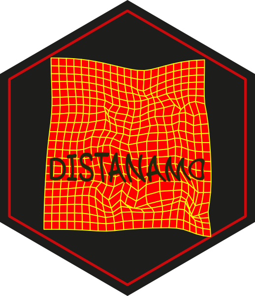
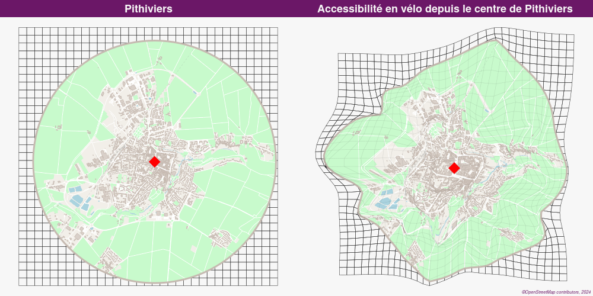
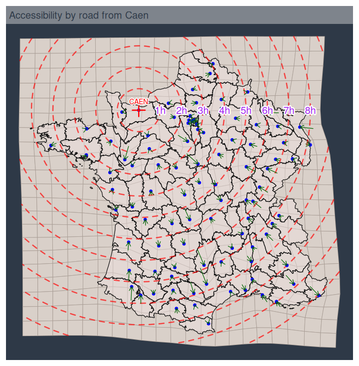

```{r, include = FALSE}
knitr::opts_chunk$set(
  collapse = TRUE,
  comment = "#>",
  fig.path = "man/figures/",
  fig.width = 6, fig.height = 6,
  dev = "png", dpi = 110
  # out.width = "100%"
)
```


# Distanamo 

<!-- [](https://github.com/riatelab/distanamo/actions/workflows/R-CMD-check.yaml) -->
[](https://riatelab.r-universe.dev/distanamo)
[](https://www.repostatus.org/#active)

This package allows you to create distance cartograms (or distance anamorphoses, hence the name).

Distance cartograms are a type of cartogram that deforms the layers of a map according to the distances
between a set of source points and a set of image points.

This is done by extending (by interpolation) to the layer(s) of the study area (territorial divisions, network...) the
local displacement between the source coordinates and the image coordinates, derived from the distances between each pair
of homologous points (source / image points).

The relation between the source points and the image points, and thus the relative position of the image points compared
to the source points, must depend on the studied theme (such as positions in access time for which this package provides
some helper functions to generate the image points from the durations between the points).

## Installation

You can install `distanamo` from [riatelab's R-universe](https://riatelab.r-universe.dev/) with:

```R
install.packages('distanamo', repos = c('https://riatelab.r-universe.dev', 'https://cloud.r-project.org'))
```

Alternatively, you can install the development version of `distanamo` from GitHub with:

```R
# install.packages("remotes")
remotes::install_github("riatelab/distanamo")
```

Note that to install from GitHub, you will need the [Rust toolchain](https://rustup.rs/) to compile the Rust code
and that the Minimum Supported Rust Version (MSRV) is 1.82.0.

## Usage

### Basics
To use this package you need to provide two sets of homologous points : *source points* and *image points*.
They are used to create an interpolation grid that will be used to deform the layer(s) of interest.

```{r, fig.width=5,fig.height=5, fig.show='hold'}
library(sf)
library(distanamo)
# Read source points, image points and the background layer to deform
source_pts <- st_read(
  dsn = system.file("gpkg/data-prefecture.gpkg", package = "distanamo"),
  layer = 'prefecture', quiet = TRUE
)
image_pts <- st_read(
  dsn = system.file("gpkg/data-prefecture.gpkg", package = "distanamo"),
  layer = 'image-points', quiet = TRUE
)
background_layer <- st_read(
  dsn = system.file("gpkg/data-prefecture.gpkg", package = "distanamo"),
  layer = 'departement', quiet = TRUE
)

# Create the interpolation grid
igrid <- dc_create(
  source_points = source_pts, 
  image_points = image_pts, 
  precision = 2, 
  bbox = st_bbox(background_layer)
)

# Use it to deform our layer of interest
deformed_background <- dc_interpolate(igrid, background_layer)

# Display the deformed layer
plot(st_geometry(deformed_background))
```

```{r, fig.width=10,fig.height=10, fig.show='hold'}
# Display useful information
summary(igrid)

# Plot information about the interpolation grid
par(mfrow = c(2, 2))
plot(igrid, ask = FALSE)
par(mfrow = c(1, 1))
```

### Detailed examples and advanced usages

The detailed vignette provided with the package adresses the following features and more advanced usages: 

- Adjusting the image points to the source points using an affine or a Euclidean transformation.
- Generating image points from a reference point and travel times from the reference point to all the other points (*unipolar accessibility*)
- Generating image points from a durations matrix between all the points (*multipolar accessibility*)
- Deforming multiple layers at once

## Examples





<!-- *Maps made with [`mapsf`](https://github.com/riatelab/mapsf).* -->


## More information about the origin of the method

- This is a port of the **[Darcy](https://thema.univ-fcomte.fr/productions/software/darcy/)** standalone software regarding the bidimensional regression and the background
layers deformation.  
All credit for the contribution of the method goes to **Colette Cauvin** *(Théma - Univ. Franche-Comté)* and for the
reference Java implementation goes to **Gilles Vuidel** *(Théma - Univ. Franche-Comté)*.

- This method is also available as a **QGIS plugin** ([GitHub repository](https://github.com/mthh/QgisDistanceCartogramPlugin) / [QGIS plugin repository](https://plugins.qgis.org/plugins/dist_cartogram/)).

- This R package is a wrapper around the Rust library [`distance-cartogram-rs`](https://github.com/mthh/distance-cartogram-rs) which can be used directly from Rust.

## Related projects
Note that this package is more geared towards the creation of cartograms based on the bidimensional regression
technique than specifically towards the study and comparison of two 2D configurations in order to assess their
similarity. For this we recommend using the [BiDimRegression](https://CRAN.R-project.org/package=BiDimRegression)
package which is geared towards applying bidimensional regression in the area of psychological research, face research
and comparison of 2D-data patterns in general.
Other functionalities close to those proposed in this package (in particular concerning multidimensional scaling
and the rotation/scaling/translating/reflection of one set of points to fit another) can also be found in the
[vegan](https://CRAN.R-project.org/package=vegan) package for example.


## References

### About the method

- Cauvin, C. (2005). A systemic approach to transport accessibility. A methodology developed in Strasbourg: 1982-2002. Cybergeo: European Journal of Geography. DOI: [10.4000/cybergeo.3425](https://doi.org/10.4000/cybergeo.3425).

- Cauvin, C., & Vuidel, G. (2009). Darcy 2.0 - Mode d'emploi (https://thema.univ-fcomte.fr/productions/software/darcy/download/me_darcy.pdf).

- Tobler, W. R. (1994). Bidimensional regression. Geographical Analysis, 26(3), 187-212. DOI: [10.1111/j.1538-4632.1994.tb00320.x](https://doi.org/10.1111/j.1538-4632.1994.tb00320.x)

- Bronner, A. C. (2023).  Cartogrammes, anamorphoses : des territoires transformés. In Traitements et cartographie de l’information géographique, ISTE Group (pp.231-271). DOI: [10.51926/ISTE.9161.ch7](https://doi.org/10.51926/ISTE.9161.ch7).


### About distance (or time) cartograms in general: their usability, the other methods to create them, etc.

- Ullah, R., Mengistu, E., van Elzakker, C. & Kraak, M. (2016). Usability evaluation of centered time cartograms. Open Geosciences, 8(1), 337-359. DOI: [10.1515/geo-2016-0035](https://doi.org/10.1515/geo-2016-0035).

- Hong, S., Kim, Y. S., Yoon, J. C., & Aragon, C. (2014). Traffigram: distortion for clarification via isochronal cartography. In Proceedings of the SIGCHI Conference on Human Factors in Computing Systems (pp. 907–916). Association for Computing Machinery. DOI: [10.1145/2556288.2557224](https://doi.org/10.1145/2556288.2557224).

- Ullah, R., Kraak, M. J., & Van Elzakker, C. (2013). Using cartograms to explore temporal data: do they work. GeoViz, 2013.

- Ullah, R., & Kraak, M. J. (2014). An alternative method to constructing time cartograms for the visual representation of scheduled movement data. Journal of Maps, 11(4), 674–687. DOI: [10.1080/17445647.2014.935502](https://doi.org/10.1080/17445647.2014.935502).

- Hong, S., Kocielnik, R., Min-Joon Yoo, Battersby, S., Juho Kim, & Aragon, C. (2017). Designing interactive distance cartograms to support urban travelers. In 2017 IEEE Pacific Visualization Symposium (PacificVis) (pp. 81-90).

- Shimizu, E. and Inoue, R. (2009). A new algorithm for distance cartogram construction. International Journal of Geographical Information Science 23(11): 1453-1470. DOI: [10.1080/13658810802186882](https://doi.org/10.1080/13658810802186882).


## License

**GPL-3.0**
