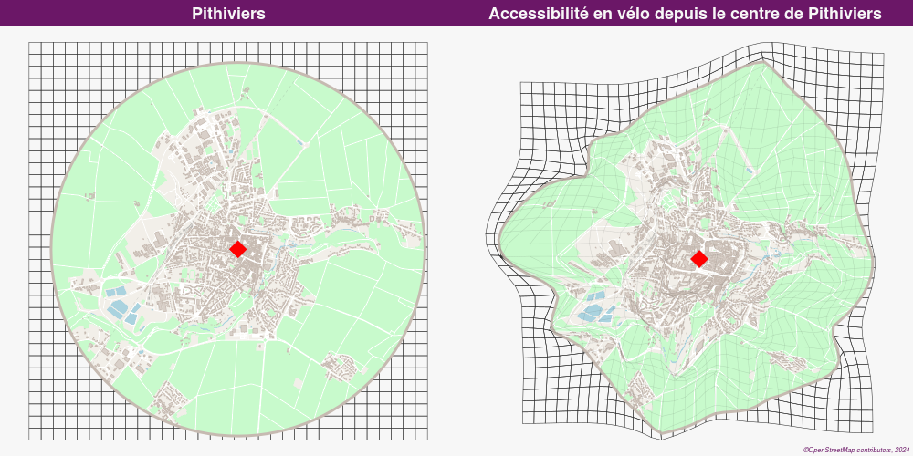

# Distanamo

This package allows you to create distance cartograms (or distance anamorphoses, hence the name).

Distance cartograms are a type of cartogram that deforms the layers of a map according to the distances
between a set of source points and a set of image points.

This is done by extending (by interpolation) to the layer(s) of the study area (territorial divisions, network...) the
local displacement between the source coordinates and the image coordinates, derived from the distances between each pair
of homologous points (source / image points).

The relation between the source points and the image points, and thus the relative position of the image points compared
to the source points, must depend on the studied theme (such as positions in access time for which this package provides
some helper functions to generate the image points from the durations between the points).

Note that this package is more geared towards the creation of cartograms based on the bidimensional regression
technique than specifically towards the study and comparison of two 2D configurations in order to assess their
similarity. For this we recommend using the [BiDimRegression](https://CRAN.R-project.org/package=BiDimRegression)
package which is geared towards applying bidimensional regression in the area of psychological research, face research
and comparison of 2D-data patterns in general.
Other functionalities close to those proposed in this package (in particular concerning multidimensional scaling
and the rotation/scaling/translating/reflection of one set of points to fit another) can also be found in the
[Vegan](https://CRAN.R-project.org/package=vegan) package for example.


## Installation

You can install the development version of `distanamo` from GitHub with:

```R
# install.packages("remotes")
remotes::install_github("riatelab/distanamo")
```

You will need the [Rust toolchain](https://rustup.rs/) to compile the Rust code.
The Minimum Supported Rust Version (MSRV) is 1.82.0.

The package is not yet on CRAN or on R-universe.

## Usage

To use this package you need to provide two sets of homologous points : *source points* and *image points*.
They are used to create an interpolation grid that will be used to deform the layer(s) of interest.

```R
# Read source points, image points and the background layer to deform
source_pts <- sf::st_read('data-source-point.geojson')
image_pts <- sf::st_read('data-image-point.geojson')
background_layer <- sf::st_read('background.geojson')
bbox <- sf::st_bbox(background_layer)

# Create the interpolation grid
igrid <- dc_create(source_pts, image_pts, 2.0, bbox)

# Use it to deform our layer of interest
deformed_background <- dc_interpolate(igrid, background_layer)

# Display useful information
summary(igrid)

# Plot information about the interpolation grid
plot(igrid)
```

### Generating image points from a reference point and durations from the reference point to all the other points

Optionally you can provide a layer of source points and matrix of duration between
the points.

This duration matrix will be used to extract the duration between a reference point
and all the other points, allowing to use the `dc_move_from_reference_point` function to move closer / farther
points from the reference point depending on if they can be reached faster or slower of
the mean speed (between the reference point and all the others).

```R
# Read source points and layer to be deformed
source_pts <- sf::st_read('data-source-point.geojson')
background_layer <- sf::st_read('background.geojson')
bbox <- sf::st_bbox(background_layer)

# Read durations between points
d <-read.csv('mat.csv', row.names = 1)

# The CSV is a time matrix structured as follow
#           AGEN   BORDEAUX   GRENOBLE etc.
# AGEN      0.0    111.2      200.3
# BORDEAUX  112.3  0.0        300.1
# GRENOBLE  199.4  301.1      0.0
# etc.
dv <- d['GRENOBLE', ]
# So we have only the duration between GRENOBLE and all the other points
#          AGEN   BORDEAUX   GRENOBLE etc.
# GRENOBLE 199.4  301.1      0.0

source_pts$durations <- as.double(dv)

ref_point <- subset(source_pts, source_pts$NOM_COM == "GRENOBLE")
other_points <- subset(source_pts, !source_pts$NOM_COM == "GRENOBLE")

# Move points to create the image points layer
positioning_result <- dc_move_from_reference_point(
  reference_point = ref_point,
  other_points = other_points,
  duration_col_name = "durations",
  factor = 1
)

# Create the interpolation grid
igrid <- dc_create(
  positioning_result$source_points,
  positioning_result$image_points,
  2.0,
  bbox
)

# Deform the target layer
deformed_background <- dc_interpolate(igrid, background_layer)

plot(sf::st_geometry(deformed_background))
```

### Generating image points from a durations matrix between all the points

Optionally you can provide a matrix of durations between all the points as well as the positions of the source points and use the
`dc_generate_positions_from_durations` function to generate the image points.

This function will perform Principal Coordinates Analysis (PCoA, a form a Multidimensional scaling) on the duration matrix to generate the positions of the points in a 2D space.
It will then adjust these points (using an affine or a Euclidean transformation) to the source points to generate the final image points that can be used to create the interpolation grid.

```R
# Read source points and layer to be deformed
source_pts <- sf::st_read('data-source-point.geojson')
background_layer <- sf::st_read('background.geojson')

# Read durations between points
d <-read.csv('mat.csv', row.names = 1)
# The CSV is a time matrix structured as follow
#           AGEN   BORDEAUX   GRENOBLE etc.
# AGEN      0.0    111.2      200.3
# BORDEAUX  112.3  0.0        300.1
# GRENOBLE  199.4  301.1      0.0
# etc.

pos_result <- dc_generate_positions_from_durations(d, source_pts)

# Display useful information about the result of the positioning
summary(pos_result)
plot(pos_result)

# Create the interpolation grid
igrid <- dc_create(
  pos_result$source_points,
  pos_result$image_points,
  2.0,
  sf::st_bbox(background_layer)
)

summary(igrid)
plot(igrid)

# Deform the target layer
deformed_background <- dc_interpolate(igrid, background_layer)

plot(sf::st_geometry(deformed_background))
```

### Deforming multiple layers at once

If you want to deform multiple layers in parallel with an interpolation grid, you can use the `dc_interpolate_parallel`
function.

```R
result_layers <- dc_interpolate_parallel(
  igrid,
  list(layer1, layer2, layer3)
)
```

## Example


*Map made with [`mapsf`](https://github.com/riatelab/mapsf).*

## More information about the origin of the method

- This is a port of the **[Darcy](https://thema.univ-fcomte.fr/productions/software/darcy/)** standalone software regarding the bidimensional regression and the backgrounds layers deformation.  
All credits for the contribution of the method goes to **Colette Cauvin** *(Théma - Univ. Franche-Comté)* and for the reference Java implementation goes to **Gilles Vuidel** *(Théma - Univ. Franche-Comté)*.

- This method is also available as a **QGIS plugin** ([GitHub repository](https://github.com/mthh/QgisDistanceCartogramPlugin) / [QGIS plugin repository](https://plugins.qgis.org/plugins/dist_cartogram/)).

- This R package is a wrapper around the Rust library [`distance-cartogram-rs`](https://github.com/mthh/distance-cartogram-rs)
  which can be used directly from Rust.

## References

- Cauvin, C. (2005). A systemic approach to transport accessibility. A methodology developed in Strasbourg: 1982-2002. Cybergeo: European Journal of Geography (DOI: [10.4000/cybergeo.3425](https://doi.org/10.4000/cybergeo.3425)).

- Cauvin, C., Vuidel, G. (2009). Darcy 2.0 - Mode d'emploi (https://thema.univ-fcomte.fr/productions/software/darcy/download/me_darcy.pdf) (in French).

- Tobler, W. R. (1994). Bidimensional regression. Geographical Analysis, 26(3), 187-212.

## License

**GPL-3.0**
