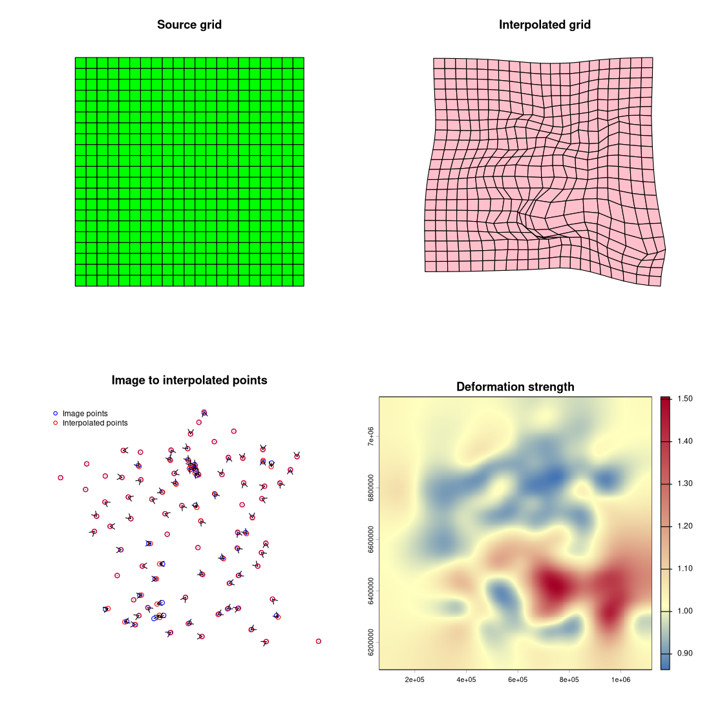
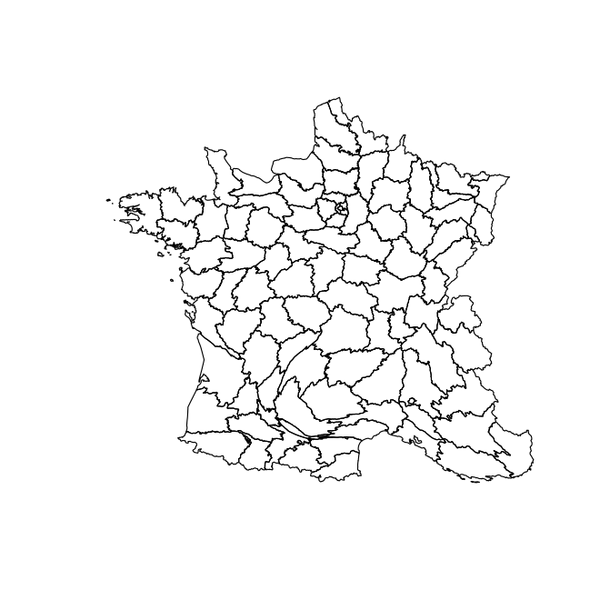
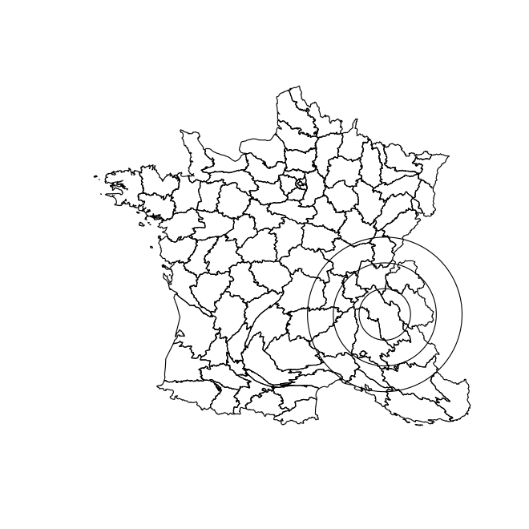
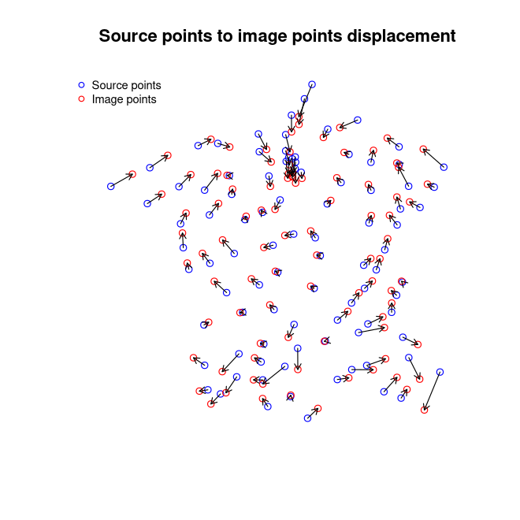
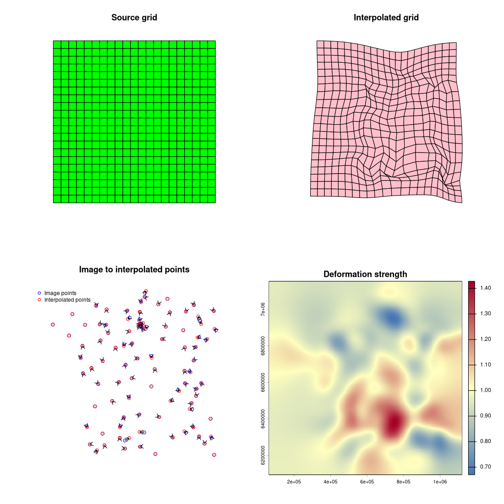
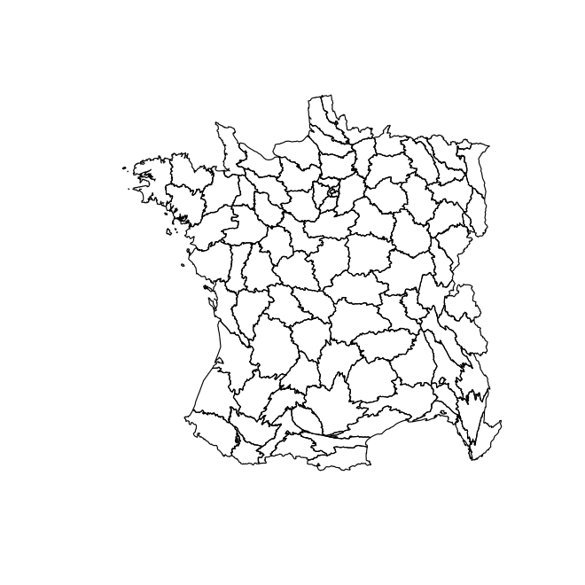

# Distanamo 

<!-- [](https://github.com/riatelab/distanamo/actions/workflows/R-CMD-check.yaml) -->

[](https://riatelab.r-universe.dev/distanamo)
[](https://www.repostatus.org/#active)

This package allows you to create distance cartograms (or distance
anamorphoses, hence the name).

Distance cartograms are a type of cartogram that deforms the layers of a
map according to the distances between a set of source points and a set
of image points.

This is done by extending (by interpolation) to the layer(s) of the
study area (territorial divisions, network…) the local displacement
between the source coordinates and the image coordinates, derived from
the distances between each pair of homologous points (source / image
points).

The relation between the source points and the image points, and thus
the relative position of the image points compared to the source points,
must depend on the studied theme (such as positions in access time for
which this package provides some helper functions to generate the image
points from the durations between the points).

Note that this package is more geared towards the creation of cartograms
based on the bidimensional regression technique than specifically
towards the study and comparison of two 2D configurations in order to
assess their similarity. For this we recommend using the
[BiDimRegression](https://CRAN.R-project.org/package=BiDimRegression)
package which is geared towards applying bidimensional regression in the
area of psychological research, face research and comparison of 2D-data
patterns in general. Other functionalities close to those proposed in
this package (in particular concerning multidimensional scaling and the
rotation/scaling/translating/reflection of one set of points to fit
another) can also be found in the
[Vegan](https://CRAN.R-project.org/package=vegan) package for example.

## Installation

You can install `distanamo` from [riatelab’s
R-universe](https://riatelab.r-universe.dev/) with:

``` r
install.packages('distanamo', repos = c('https://riatelab.r-universe.dev', 'https://cloud.r-project.org'))
```

Alternatively, you can install the development version of `distanamo`
from GitHub with:

``` r
# install.packages("remotes")
remotes::install_github("riatelab/distanamo")
```

Note that to install from GitHub, you will need the [Rust
toolchain](https://rustup.rs/) to compile the Rust code and that the
Minimum Supported Rust Version (MSRV) is 1.82.0.

## Usage

### Basics

To use this package you need to provide two sets of homologous points :
*source points* and *image points*. They are used to create an
interpolation grid that will be used to deform the layer(s) of interest.

``` r
library(sf)
#> Linking to GEOS 3.13.1, GDAL 3.10.3, PROJ 9.6.0; sf_use_s2() is TRUE
library(distanamo)
# Read source points, image points and the background layer to deform
source_pts <- st_read(
  dsn = system.file("gpkg/data-prefecture.gpkg", package = "distanamo"),
  layer = 'prefecture', quiet = TRUE
)
image_pts <- st_read(
  dsn = system.file("gpkg/data-prefecture.gpkg", package = "distanamo"),
  layer = 'image-points', quiet = TRUE
)
background_layer <- st_read(
  dsn = system.file("gpkg/data-prefecture.gpkg", package = "distanamo"),
  layer = 'departement', quiet = TRUE
)

bbox <- sf::st_bbox(background_layer)

# Create the interpolation grid
igrid <- dc_create(source_pts, image_pts, 2.0, bbox)

# Use it to deform our layer of interest
deformed_background <- dc_interpolate(igrid, background_layer)

# Display useful information
summary(igrid)
#> Summary of the interpolation grid:
#> Number of cells: 441 
#> Precision: 50462.76 (α = 2) 
#> Deformation strength: 1.041534 
#> Mean absolute error: 3734.717 
#> RMSE (interp - image): 4989.972 
#> RMSE x (interp - image): 4060.84 
#> RMSE y (interp - image): 2899.896 
#> RMSE (interp - source): 42725.87 
#> RMSE x (interp - source): 32080.25 
#> RMSE y (interp - source): 28219.8 
#> R squared: 0.9997285

# Plot information about the interpolation grid
par(mfrow=c(2,2))
plot(igrid, ask = FALSE)
par(mfrow=c(1,1))
```

<!-- -->

### Adjusting the image points to the source points

In some cases, you may want to adjust the image points to the source
points using an affine or a Euclidean transformation.

For example, here, if the image points represent locations in spatial
cognition (and thus are not directly comparable to the source points,
aren’t in the same coordinate system, etc.), you need to adjust them to
the source points.

``` r
pos_result <- dc_adjust(
    source_points = source_pts,
    image_points = image_pts,
    adjustment_type = "euclidean"
)

# Create the interpolation grid
igrid <- dc_create(
  source_points = pos_result$source_points,
  image_points = pos_result$image_points,
  precision = 2.0, 
  bbox = bbox
)
```

This is also what is done internally when using the
`dc_generate_positions_from_durations` function (see below) after it has
performed a Principal Coordinates Analysis (PCoA) on the duration
matrix.

### Generating image points from a reference point and travel times from the reference point to all the other points

Optionally you can provide a layer of source points and matrix of
durations between the points.

This durations matrix will be used to extract the duration between a
reference point and all the other points, allowing to use the
`dc_move_from_reference_point` function to move closer / farther points
from the reference point depending on if they can be reached faster or
slower of the average speed (between the reference point and all the
others).

The cartogram obtained by this method qualifies the *unipolar
accessibility* of a location (the reference point used in the
`dc_move_from_reference_point` function). It’s also sometimes referred
to as a *centered time cartogram*.

``` r
# Read source points and layer to be deformed
source_pts <- st_read(
  dsn = system.file("gpkg/data-prefecture.gpkg", package = "distanamo"),
  layer = 'prefecture', quiet = TRUE
)
background_layer <- st_read(
  dsn = system.file("gpkg/data-prefecture.gpkg", package = "distanamo"),
  layer = 'departement', quiet = TRUE
)
bbox <- sf::st_bbox(background_layer)

# Read durations between points
d <- read.csv(system.file("csv/mat.csv", package = "distanamo"), row.names = 1)
d[1:5, 1:5]
#>                 RODEZ LE.PUY.EN.VELAY POITIERS VALENCE CRETEIL
#> RODEZ             0.0           173.4    307.3   252.8   414.1
#> LE PUY-EN-VELAY 173.1             0.0    337.6   112.3   358.8
#> POITIERS        307.7           336.8      0.0   402.5   213.3
#> VALENCE         252.6           114.1    402.6     0.0   353.4
#> CRETEIL         414.7           359.0    214.5   354.4     0.0

dv <- d['GRENOBLE', ]
# So we have only the duration between GRENOBLE and all the other points
dv[1:5]
#>          RODEZ LE.PUY.EN.VELAY POITIERS VALENCE CRETEIL
#> GRENOBLE 311.7           172.2      413      64   352.3

source_pts$durations <- as.double(dv)

ref_point <- subset(source_pts, source_pts$NOM_COM == "GRENOBLE")
other_points <- subset(source_pts, !source_pts$NOM_COM == "GRENOBLE")

# Move points to create the image points layer
positioning_result <- dc_move_from_reference_point(
  reference_point = ref_point,
  other_points = other_points,
  duration_col_name = "durations",
  factor = 1
)

# Create the interpolation grid
igrid <- dc_create(
  positioning_result$source_points,
  positioning_result$image_points,
  2.0,
  bbox
)

# Deform the target layer
deformed_background <- dc_interpolate(igrid, background_layer)

plot(st_geometry(deformed_background))
```

<!-- -->

A popular way of representing this type of cartogram is to add
concentric circles (separated by a constant time) around the reference
point. This can be done using the `dc_concentric_circles` function and
the result of the `dc_move_from_reference_point` function (note that the
steps parameter is the travel time, in the same unit as the durations
matrix, between each circle).

``` r
circles <- dc_concentric_circles(
  positioning_result,
  steps = list(60, 120, 180)
)
plot(st_geometry(deformed_background))
plot(st_geometry(circles), add = TRUE)
```

<!-- -->

### Generating image points from a durations matrix between all the points

Optionally you can provide a matrix of travel times between all the
points as well as the positions of the source points and use the
`dc_generate_positions_from_durations` function to generate the image
points.

This function will perform Principal Coordinates Analysis (PCoA, a form
a Multidimensional scaling) on the durations matrix to generate the
positions of the points in a 2D space. It will then adjust these points
(using an affine or a Euclidean transformation) to the source points to
generate the final image points that can be used to create the
interpolation grid.

The cartogram obtained by this method qualifies the *global
accessibility* (or the *multipolar accessibility*) of a territory by
visualizing the travel times between all pairs of locations.

``` r
# Read source points and layer to be deformed
source_pts <- st_read(
  dsn = system.file("gpkg/data-prefecture.gpkg", package = "distanamo"),
  layer = 'prefecture', quiet = TRUE
)
background_layer <- st_read(
  dsn = system.file("gpkg/data-prefecture.gpkg", package = "distanamo"),
  layer = 'departement', quiet = TRUE
)

# Read durations between points
d <- read.csv(system.file("csv/mat.csv", package = "distanamo"), row.names = 1)

pos_result <- dc_generate_positions_from_durations(d, source_pts)

# Display useful information about the result of the positioning
summary(pos_result)
#> Summary of the multipolar displacement result:
#> Min displacement: 2349.236 [m] 
#> Mean displacement: 34569.15 [m] 
#> Max displacement: 108405.5 [m] 
#> Transformation matrix:
#>      358.1063 1126.673 673162.7 
#>      -1170.315 396.8617 6619705 
#> Scale: 1208.994 
#> RMSE: 39842.59 
#> RMSE x: 25310.6 
#> RMSE y: 30770.21
plot(pos_result)
```

<!-- -->

``` r
# Create the interpolation grid
igrid <- dc_create(
  pos_result$source_points,
  pos_result$image_points,
  2.0,
  sf::st_bbox(background_layer)
)

summary(igrid)
#> Summary of the interpolation grid:
#> Number of cells: 441 
#> Precision: 50462.76 (α = 2) 
#> Deformation strength: 0.9896468 
#> Mean absolute error: 5015.278 
#> RMSE (interp - image): 5765.391 
#> RMSE x (interp - image): 4292.306 
#> RMSE y (interp - image): 3849.135 
#> RMSE (interp - source): 38103.94 
#> RMSE x (interp - source): 24114.01 
#> RMSE y (interp - source): 29502.97 
#> R squared: 0.999635
par(mfrow=c(2,2))
plot(igrid, ask = FALSE)
par(mfrow=c(1,1))
```

<!-- -->

``` r
# Deform the target layer
deformed_background <- dc_interpolate(igrid, background_layer)

plot(sf::st_geometry(deformed_background))
```

<!-- -->

### Deforming multiple layers at once

If you want to deform multiple layers in parallel with an interpolation
grid, you can use the `dc_interpolate_parallel` function.

``` r
result_layers <- dc_interpolate_parallel(
  igrid,
  list(layer1, layer2, layer3)
)
```

## Examples

<figure>

<figcaption aria-hidden="true">Example of distance cartogram
(Accessibility by bike from the center of Pithiviers)</figcaption>
</figure>

<figure>

<figcaption aria-hidden="true">Example of distance cartogram
(Accessibility by car from Caen)</figcaption>
</figure>

*Maps made with [`mapsf`](https://github.com/riatelab/mapsf).*

## More information about the origin of the method

- This is a port of the
  **[Darcy](https://thema.univ-fcomte.fr/productions/software/darcy/)**
  standalone software regarding the bidimensional regression and the
  background layers deformation.  
  All credit for the contribution of the method goes to **Colette
  Cauvin** *(Théma - Univ. Franche-Comté)* and for the reference Java
  implementation goes to **Gilles Vuidel** *(Théma - Univ.
  Franche-Comté)*.

- This method is also available as a **QGIS plugin** ([GitHub
  repository](https://github.com/mthh/QgisDistanceCartogramPlugin) /
  [QGIS plugin
  repository](https://plugins.qgis.org/plugins/dist_cartogram/)).

- This R package is a wrapper around the Rust library
  [`distance-cartogram-rs`](https://github.com/mthh/distance-cartogram-rs)
  which can be used directly from Rust.

## References

### About the method

- Cauvin, C. (2005). A systemic approach to transport accessibility. A
  methodology developed in Strasbourg: 1982-2002. Cybergeo: European
  Journal of Geography. DOI:
  [10.4000/cybergeo.3425](https://doi.org/10.4000/cybergeo.3425).

- Cauvin, C., & Vuidel, G. (2009). Darcy 2.0 - Mode d’emploi
  (<https://thema.univ-fcomte.fr/productions/software/darcy/download/me_darcy.pdf>).

- Tobler, W. R. (1994). Bidimensional regression. Geographical Analysis,
  26(3), 187-212. DOI:
  [10.1111/j.1538-4632.1994.tb00320.x](https://doi.org/10.1111/j.1538-4632.1994.tb00320.x)

- Bronner, A. C. (2023). Cartogrammes, anamorphoses : des territoires
  transformés. In Traitements et cartographie de l’information
  géographique, ISTE Group (pp.231-271). DOI:
  [10.51926/ISTE.9161.ch7](https://doi.org/10.51926/ISTE.9161.ch7).

### About distance (or time) cartograms in general: their usability, the other methods to create them, etc.

- Ullah, R., Mengistu, E., van Elzakker, C. & Kraak, M. (2016).
  Usability evaluation of centered time cartograms. Open Geosciences,
  8(1), 337-359. DOI:
  [10.1515/geo-2016-0035](https://doi.org/10.1515/geo-2016-0035).

- Hong, S., Kim, Y. S., Yoon, J. C., & Aragon, C. (2014). Traffigram:
  distortion for clarification via isochronal cartography. In
  Proceedings of the SIGCHI Conference on Human Factors in Computing
  Systems (pp. 907–916). Association for Computing Machinery. DOI:
  [10.1145/2556288.2557224](https://doi.org/10.1145/2556288.2557224).

- Ullah, R., Kraak, M. J., & Van Elzakker, C. (2013). Using cartograms
  to explore temporal data: do they work. GeoViz, 2013.

- Ullah, R., & Kraak, M. J. (2014). An alternative method to
  constructing time cartograms for the visual representation of
  scheduled movement data. Journal of Maps, 11(4), 674–687. DOI:
  [10.1080/17445647.2014.935502](https://doi.org/10.1080/17445647.2014.935502).

- Hong, S., Kocielnik, R., Min-Joon Yoo, Battersby, S., Juho Kim, &
  Aragon, C. (2017). Designing interactive distance cartograms to
  support urban travelers. In 2017 IEEE Pacific Visualization Symposium
  (PacificVis) (pp. 81-90).

- Shimizu, E. and Inoue, R. (2009). A new algorithm for distance
  cartogram construction. International Journal of Geographical
  Information Science 23(11): 1453-1470. DOI:
  [10.1080/13658810802186882](https://doi.org/10.1080/13658810802186882).

## License

**GPL-3.0**
